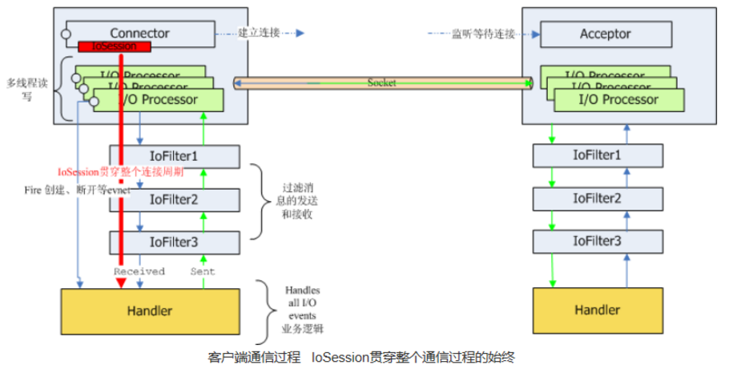

# minaTest
Apache Mina Server 是一个网络通信应用框架，主要是对基于TCP/IP、UDP/IP协议栈的通信框架

工作流程:

服务端流程：
1、通过SocketAcceptor 同客户端建立连接；
2、连接建立之后 I/O的读写交给了I/O Processor线程，I/O Processor是多线程的；
3、通过I/O Processor 读取的数据经过IoFilterChain里所有配置的IoFilter，IoFilter进行消息的过滤，格式的转换，在这个层面可以制定一些自定义的协议；
4、最后IoFilter将数据交给 Handler  进行业务处理，完成了整个读取的过程；
写入过程也是类似，只是刚好倒过来，通过IoSession.write 写出数据，然后Handler进行写入的业务处理，处理完成后交给IoFilterChain，进行消息过滤和协议的转换，最后通过 I/O Processor 将数据写出到 socket 通道。

测试：
服务端TCPServer启动，用telnet 127.0.0.1 9124 访问，然後输入一些内容 按下回车键，会发现服务端接收到消息。